# How to Install and Use Pyenv in Ubuntu?

The pyenv is a tool used to manage the different versions of Python. Python language is used to develop web and mobile applications for different purposes. To test these python codes in different versions of Python, instead of installing different versions of python, we use pyenv.

The pyenv can be installed on different distributions of Linux. In this write-up, we are focussed on the installation of pyenv on Ubuntu. The outcomes are demonstrated as:


*  How to Install Pyenv on Ubuntu 22.04?

* How to Use Pyenv on Ubuntu?

    * Command 1: To Display All the Available Versions of Pyenv
    * Command 2: Install Any Specific Version of Python
    * Command 3: Display All the Installed Versions of Python
    * Command 4: To Set a Specific Version as the Global in Ubuntu
    * Command 5: Uninstall Any Specific Python’s Version From Ubuntu
* How to Uninstall Pyenv on Ubuntu?

Let’s start!

# How to Install Pyenv on Ubuntu 22.04?

### Step 1: Update the Ubuntu Repository

We will first update the packages of Ubuntu via the core libraries using the command:

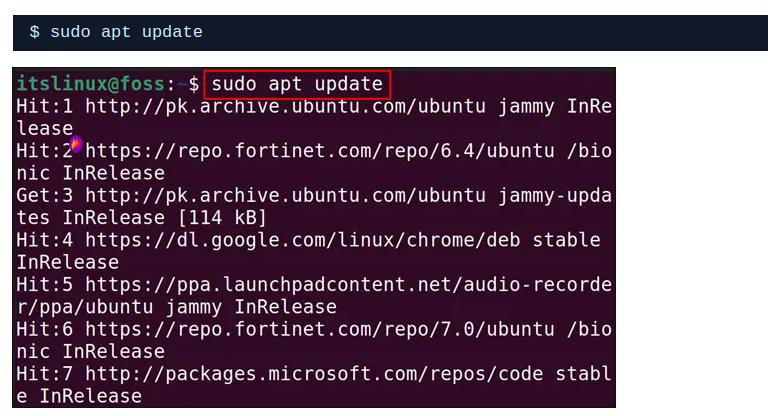


Figure 01 - sudo apt update command issued.


# Step 2: Download the Script of Pyenv in Ubuntu

Next step is to download the script of Pyenv and also execute the downloaded script using the command:

$ curl https://pyenv.run | bash

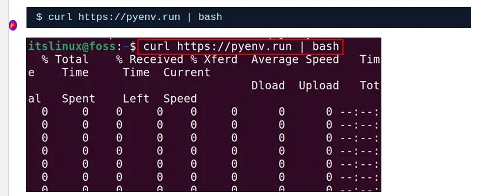

Figure 02 - Download Pyenv and install.

At the end of the script, the further installation guidelines are mentioned:

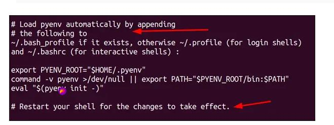

Figure 03 - Pyenve final installation message.

Let’s proceed with further steps as directed above.

### Note: Dependency Errors While Installing Pyenv

If any dependencies error occurs, such as curl or git, then you can use the following commands to get rid of them:

$ sudo apt install curl -y 

$ sudo apt install git -y

After the successful execution of the above command, the issue of the curl command is not found will be resolved.

# Step 3: Add the Environment Variables Into bashrc File

After downloading and executing the bash script of the pyenv, we will add some environment variables using the command:


```bash
export PATH="$HOME/.pyenv/bin:$PATH" && eval "$(pyenv init --path)" && echo -e 'if command -v pyenv 1>/dev/null 2>&1; then\n eval "$(pyenv init -)"\nfi' >> ~/.bashrc
```

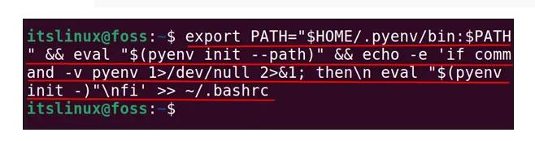

Figure 04 - Editing the bashrc file.

# Step 4: Restart the Shell in Ubuntu

Next step is to restart the shell in Ubuntu with the execution of the command:

```bash
exec $SHELL
```

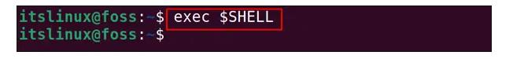

Figure 05 - SHELL command restarted

# Step 5: Display the Installed Version of the Pyenv in Ubuntu

Final step is to display the version of the installed Pyenv to confirm its installation by running the command:


$ pyenv --version

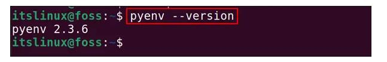

Figure 06 - Pyenv installation completed!

2.3.6 version of the pyenv has been installed in Ubuntu.


# How to Use Pyenv on Ubuntu?

Pyenv is used to install and switch different versions of Python versions. Different basic commands of the Pyenv are practiced below.

### Command 1: To Display All the Available Versions of Pyenv

To list down all versions of Python available in the Pyenv which can be installed on Ubuntu are:

```bash
pyenv install --list
```

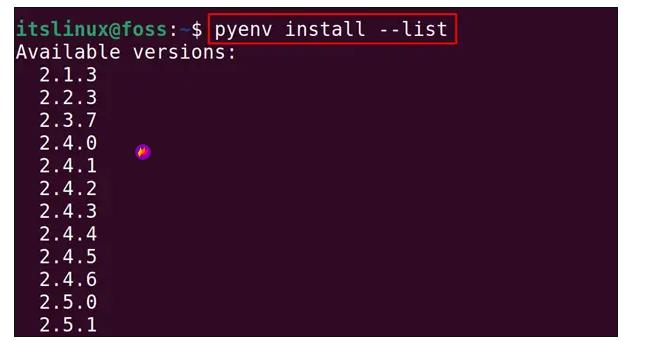

Figure 07 - Pyenv list installation

# Command 2: Install Any Specific Version of Python


Choose the version from the above list, and use the command “$ pyenv install [version-no]” and for instance, the command provided below will install the 3.11.0 version of Python:

```bash
pyenv install 3.12.1
```

# Command 3: Display All the Installed Versions of Python

To display all the installed versions of Python on the computer using the pyenv, run the command:

```bash
pyenv versions
```

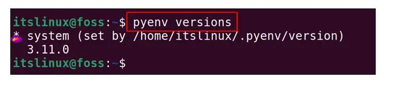

Figure 08 - Pyenv versions


# Command 4: To Set a Specific Version as the Global in Ubuntu

To set any specific python version as the system-wide, mark it as the global version. For example, we set the python version of 3.10.0 as the global with the command:

```bash
pyenv global 3.11.0
```

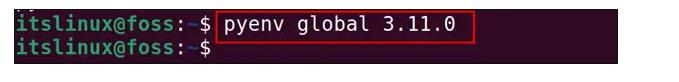

Figure 09 - Set pyenv global

It means the system uses the 3.11.0 version of Python by default.

# Command 5: Uninstall Any Specific Python Version From Ubuntu

To uninstall any installed version of Python using Pyenv, use the “uninstall” option. For instance, the following command will uninstall the 3.11.0 version of Python:

$ pyenv uninstall 3.11.0

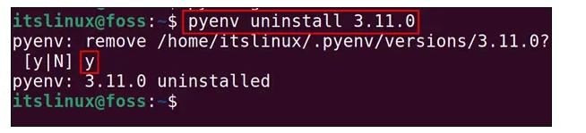

Figure 10 - Uninstall a specific python version

The output shows that version 3.11.0 of Python has been removed.

# How to Uninstall Pyenv on Ubuntu?


To uninstall the pyenv on Ubuntu, we will remove the folder of the pyenv by using the rm command:

$ rm -fr ~/.pyenv

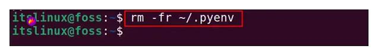

Figure 11 - The pyenv has been removed.

# Conclusion

To install the pyenv on Ubuntu, we should download its bash script using“curl https://pyenv.run | bash” and add the environment variables path into the “bashrc” file.

In this write-up, the step-by-step installation of Pyenv is explained on Ubuntu. Additionally, its manifold usages are demonstrated with practical implementation.

# How to use Pyenv on Linux

Here in this section, we are going to a set of principal command to use with pyenv.

### Check which version we have installed

```bash
pyenv versions
```

### Install Python especfict version using Pyenv

```bash
pyenv install 3.11.2
```
### Set global python version

```bash
pyenv global 3.12.1
```

### Set local python version on especific project

```bash
pyenv local 3.12.1
```
Ps.: In this case, when we execute the pyenv local command, a file named "python.version" will be created in the project folder.


# How to work with  pip + venv

This section we are going to talk all dependecies that usually is need on python project.

Here we go!

#### Let's see a set of command to get to know about pip + env


How to list the dependecies installed on your computer. 

```
pip list
```

How to install pandas

```
pip install pandas
```

How to streamlit

```
pip install streamlit
```

How to django

```
pip install django
```

This approach above is used when we want to install dependecies in the global python version. But, when we want to install the dependencies only for a especific project.

In this case, we are going to use "venv".

Before to use "venv", we need to clean all dependecies installed early.

```
pip uninstall pandas
```

```
pip uninstall django
```

```
pip uninstall streamlit
```

After that, we still need to clean all other dependecies which have been istalled with pandas, django and streamlit.

```
pip freeze | grep -v "^-e" | xargs pip uninstall -y
```

# How to use the virtual enveriment with "venv"

Create a virtual enviroment on python project folder

```
pyenv virtualenv 3.11.2 venv-name-3.11.2
```

Check:
```
pyenv versions
```

How to active the virtual enviroment which has been created? Beware that in this case this enviroment has been called as .venv

```
pyenv activate venv-name-3.11.2
```
P.S: When we execute the activation command above, the terminal will be set with venv-name -3.11.2.

Deactivate:

```
pyenv deactivate
```

Now, with virtual enviroment has been build, we can install, for example, pandas, inly for this project:

```
pip install pandas
```

After the pandas installation to this virtual envoriment, we should deactive the virtual enviroment and go to next folder:

```
pyenv deactivate
```

# How to use pipx

What is pipx ? Pipx will manage the global pip list.

Command to intall pipx:

```
pip install pipx
```

Let's install poetry and Ip[y] using pipx.

```
pipx install poetry
```

```
pipx install ipython
```


# How to use Poetry 

Poetry will guide us to manager our dependecies.

Let's use poetry to manager the django folder:

Command to set poetry to manager the virtual enviroment:

```
poetry config virtualenvs.in-project true
```

Command to create a new project with folder:

```
poetry new projeto_django
```

In the projeto_django folder, set the pyenv local version:

```
pyenv local 3.12.1
```

Set poetry to use the pyenv local 3.12.1 issued early:

```
poetry env use 3.12.1
```

Install django for this project:

```
poetry add django
```

Remove django

```
poetry remove django
```


